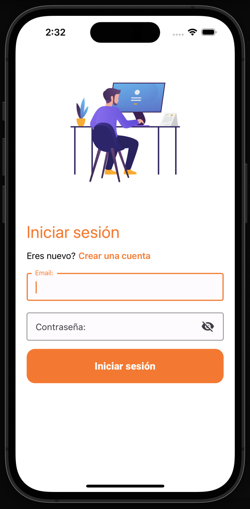
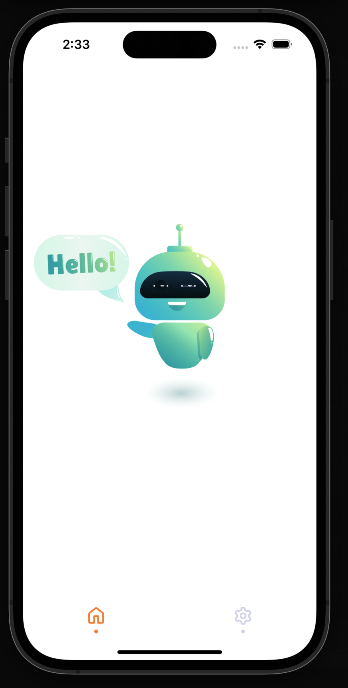
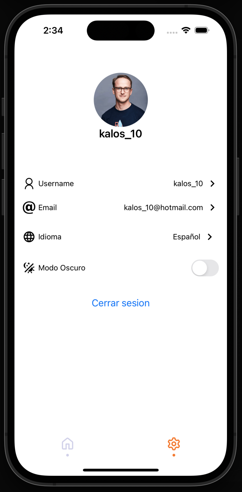

# 👨🏻‍💻 Project

This is a solution for tekbees challenge. 

## 🖥 Technologies & Languages

1. React
2. React Native
3. Expo
4. React Context
5. Firebase


## 🛠 Set Env Variables

```bash
# development
EXPO_PUBLIC_API_KEY=
EXPO_PUBLIC_AUTO_DOMAIN=
EXPO_PUBLIC_PROJECT_ID=
EXPO_PUBLIC_STORAGE_BUCKET=
EXPO_PUBLIC_MESSAGING_SENDER_ID=
EXPO_PUBLIC_APP_ID=
EXPO_PUBLIC_MEASUREMENT_ID=
```
## 🛠 Installing

```bash
# development
$ npm install
```

## 🍏 Running App

```bash
# development
$ npm start
```

## 🏞️ Screens




## 🐨 Stay in touch

- Author - [Juan Carlos Echevarria](https://juancarlosechevarria.netlify.app/)


## 🪪 License

[MIT licensed](LICENSE).

### Happy Coding! 🚀
